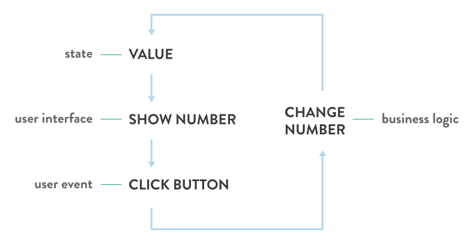

The front-end development community is a very active one, every single day people come up with new libraries, frameworks and tools to solve common problems, **each with their own view/take on how to fix them**. This has contributed on the so-called [javascript fatigue](https://www.reddit.com/r/javascript/comments/3zkycb/javascript_fatigue/) people are complaining about.

I personally think it's great, and it is what I most like about the JavaScript community. But I do understand how this can be overwhelming for beginners. Every single solution shows you how to build something _their_ way, which is perfectly reasonable, but this way you are missing the bigger picture.

What you should be asking yourself regarding libraries and frameworks is:

> * How does \_\_any library/application\_\_ fit in the overall application architecture?
> * How does it fit in **my** stack?

When I jumped into Angular some years ago I was coming from the cms/back-end world, **I didn't really know how to build solid front-end applications**, so I simply started studying Angular and its APIs, how it works and most commonly **how to get started**.

Even though it did get me started building my first applications, I wasn't really understanding why so many concepts were important, why the framework was including so many tools, how something was a better practice then anything else, and so on.

It's like learning sentences in an unknown human language, without prior knowledge about grammar itself.
Sure you can understand what they mean (if someone tells you, and you have to trust them) and you can put them together to create paragraphs, but until you know the grammar **you won't be able to really understand them**, and most importantly to **compose new ones yourself**.

## The application architecture

Let me preface that it's pretty obvious how **every application has its own architecture**, depending on **what the application does** and the arbitrary choices you make about **the tools you use** to build it.

It's pretty much like assembling a computer. You know there are some components that are absolutely mandatory for the computer to even boot up, but than you can add many optional components and I/O devices.

So, after building applications for the past ~3 years, I've come up with what I found _I_ need in every new project I work on regardless the framework I use for that particular app. These concepts are shared between frameworks and are the basic blocks on which they are built:

* Router
* HTTP library
* User Interface Layer
* State manager
* Logic

Before going into details of each block, it's useful to understand how they relate to each other. Since they are just _concepts_ it's difficult to paint _the correct_ image and once you build an application you may find the actual implementation different, and that's perfectly normal.In fact you may want to add different players to the game, such a cache, an event system, or really anything you may need for your application.

At the ends we find the user and the back end (if the application needs one). The application communicates to the back end via the HTTP library while the user interacts with the app via the UI layer. Everything else stays in a big box and blend together.

> The logic is where the code unique to your app stays. This depends a lot on what framework/libraries you use. Angular application usually have this code inside [services](http://stackoverflow.com/a/24694356/3840432), while React applications usually have this code as separate JavaScript modules included in the components. Regardless of the framework/library, my advise is to have the business logic (and actually any other code) written in plain JavaScript as much as possible to avoid [technical debt](https://www.nczonline.net/blog/2012/02/22/understanding-technical-debt/).

## The Blocks

### Router

The router is in charge of **handling the user navigation inside the application**: As your users scroll and click some links, you will naturally want to show them different pages/interfaces to interact with.

Since single page applications mimic what back-end rendered application do, every time a user navigates to a new page you may want to update the URL bar inside the browser to reflect the new position. This provides the user a way to understand the structure of the app as well as a way to directly reach/link that page (share it or bookmark it).

It doesn't stop there: routers can provide a lot more of functionality for your application, such as **url parameters** (as part of the url itself or inside the url query) or resolving data on page/url change. Some library like [UI-Router](https://github.com/angular-ui/ui-router) even provide a **full state machine** that enables you to manage complex navigation logic.

The main principle is this: the router watches the url of the page and whenever it changes, it performs custom logic, which is often rendering some component/application view inside the viewport. They also provide a way to create links inside your app, and when a user navigates in one of those links, it takes care of updating the address bar without actually refreshing the page.

Unless you're developing an application that consists in a single view and doesn't need any kind of navigation system, **the router is one of the main part of the architecture**.

I'm not gonna talk about the options here since it's usually very framework specific.

### HTTP Library

The HTTP library is in charge of handling any **request your application makes to a back-end** in order to obtain data or perform arbitrary actions. Almost every application has data that persists in a database and that is used by the application. Single page applications, by definition, are composed by a single page that loads up the app via javascript. This means that the data needed every time you change page must be requested by the application asynchronously via API calls.

As your application grows you are going to need to perform a lot of calls. The browsers expose an API called `XMLHttpRequest` (or `XHR`) that provides exactly this functionality, but it's [pretty verbose and low level](https://developer.mozilla.org/en-US/docs/Web/API/XMLHttpRequest), hence the reason why you'd want to use a wrapper library.

In addition to that, libs usually add useful functionalities, like performing requests based on [Promises](https://developer.mozilla.org/it/docs/Web/JavaScript/Reference/Global_Objects/Promise) which comes in hand when you want to chain actions with the request results.

There are a plethora of options to choose from: `jQuery.ajax()`, `axios`, `fetch`, Angular's own `$http`, and so on. As always, each has its own pros and cons, but at the end of the day they all do their job. Lately I set on [axios](https://github.com/mzabriskie/axios) and [fetch](https://github.com/github/fetch).

### UI Layer and State Manager (and Logic)

The **line between the tools for the UI layer, state and logic is blurry**, as these elements are tightly connected. Let's take this simple example:

[Counter example](embedded-codesandbox://counter?codemirror=1)

Even the simplest application such as this counter has these three concepts in place, and depending on the way you build it, they can be part of different libraries/frameworks, or your own code. Again the importance here is to understand the underlying concepts and not the [architecture patterns](https://lostechies.com/derekgreer/2007/08/25/interactive-application-architecture/) that are in place in the different solutions.

#### UI layer

Anything rendered in the browser. Layouts, text, buttons, anything. It's a two way interaction with the user, since it includes all the events that are triggered with the user interaction, such as typing on the keyboard, or move/scroll/click with the mouse. I'ts usually the biggest part of the application. It varies from plain HTML + vanilla javascript, to complex and powerful frameworks. The options are endless: [Angular.js](https://angularjs.org/), [React](http://facebook.github.io/react/), [Ember.js](http://emberjs.com/), [Cycle.js](http://cycle.js.org/), [Vue.js](http://vuejs.org/), [Backbone.js](http://backbonejs.org/) and so on...

You can easily say this is the core of your application architecture. And this is why **these tools come with tons of functionalities that go far beyond the UI layer**. Angular for example includes also a HTTP library, a router, and concepts like services, which let you handle the application state and your business logic. In fact you can build a complex application using Angular without needing anything else.

#### State manager

Everything non-esthetic shown in your application is actually data. The counter number in the example above, the messages in your email client, etc. Even though this data usually persists in a database, once it's requested by the application, must be managed and used for creating the interface.

Furthermore, interfaces need a way to handle internal logic. Think about a video player. At any given time the player must know if it is currently playing or it's paused, what is the volume level, etc. It needs to know its **state**.

Since **the state mutates in time** by the user interaction and external events, it must be managed in order to update the rendered DOM accordingly. That's what the state manager does. Being so tight with the UI, every framework has its own implementation for managing it. In the Model-View-Controller pattern implemented in Angular, the state would be the model. React let you create stateful components, providing useful API for state management. There are also stand-alone libraries such as [Redux](https://github.com/reactjs/redux), that perform this sole task.

#### Logic

Is your application a calculator? Is it a messaging app? The logic of your application is unique. It's the bridge between the front end and the back end, and also any logic needed to be applied to data and interactions. Being extremely tied to the state/model, people tend to put the logic as close (conceptually and pratically) as possible to model and the UI.

This topic is pretty advanced in terms of frameworks and design patterns and this post is not the place where to discuss it. My suggestion is to follow what are considered the best practise for each tool. As already told before, try to avoid technical debt as much as possibile.

---

Understanding these concepts and examine them in depth is the first step toward being a better engineer. This is a ever chaging industry. Try not to be too reliant on frameworks and focus on the underlying architecture, it will pay much more in the future of your career.
